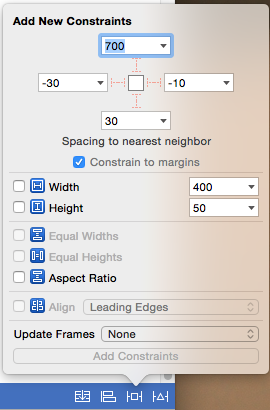
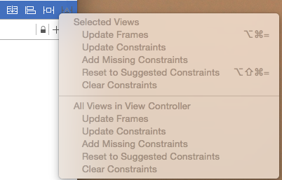

# Xcode 7.2 中Auto layout 资料更新

在storyboard界面的右下角，有这么一排图标

-

分别表示:

- Stack :  堆叠视图
- Aligen :用来设置对齐关系的约束
- Pin : 设置相对大小和位置
- Resolve Auto Layout Issues : 解决auto layout的问题

#### Stack Views:

------

如果开发过Android的朋友一定感觉很亲切，这个如何Android中的LinearLayout线性布局了。

Auto Layotu之前都是类似Android中的RelativeLayout相对布局，这次增加了Stack Views给布局带来更多的便利性。

选中一个或多个控件点击上图中的第一个图标，就将控件加入到了一个Stack View中了,也可以通过控件选择到布局中，然后再加入其它控件。

-


功能描述

- 

-


|                   |                                          |                                        |
| ----------------- | ---------------------------------------- | -------------------------------------- |
| Axis              | 选择水平方向还是垂直方向排列内部控件                       |                                        |
| Alignment         | 内部控件对齐方式。最后两项是，第一个/最后一个控件的基线对齐。Alignment 用于控制X 或 Y值。The alignment of the arranged subviews perpendicular to the stack view’s axis. |  |
| Distribution      | 定义subview的分布方式。TDistribution 用于控制高度和宽度。he distribution of the arranged views along the stack view’s axis |                                        |
| Spacing           | 控件之间的空隙                                  | 类似表格之间分隔线高度                            |
| Baseline Relative | 选中Baseline Relative将根据subview的基线调整垂直间距。A Boolean value that determines whether the vertical spacing between views is measured from their baselines. |                                        |

#### Aligen (对齐)

---

- 

－

|                                | 说明                      |                    备注                    |
| :----------------------------- | :---------------------- | :--------------------------------------: |
| Leading Edges                  | 头对齐                     |           两个视图层次中同一级的 View 的对齐           |
| Trailing Edges                 | 尾对齐                     |           两个视图层次中同一级的 View 的对齐           |
| Top Edges                      | 顶部对齐                    |           两个视图层次中同一级的 View 的对齐           |
| Bottom Edges                   | 底部对齐                    |           两个视图层次中同一级的 View 的对齐           |
| Horizontal Centers             | 水平中心对齐                  |           两个视图层次中同一级的 View 的对齐           |
| BaseLines                      | 基准线水平对齐                 | 两个视图层次中同一级的 View 的对齐。     默认 View 底部位置，用来对齐有文字的控件，如 UILabel、UIButton… |
| Horizontal Center in Container | View 的水平中心和容器的水平中心的相对距离 | 和父容器对齐选项。                         SuperView 和 SubView 的对齐，SuperView 是 SubView 的 Container |
| Vertical Center in Container   | View 的垂直中心和容器的垂直中心的相对距离 | 和父容器对齐选项。                      SuperView 和 SubView 的对齐，SuperView 是 SubView 的 Container |

***Use Current Canvas Value”，意思是使用当前 Xib/Storyboard 内的差值。***

*Top/Bottom Layout Guide*

``` 
Top/Bottom Layout Guide(顶端/底边布局指示线)即把固有界面要素（如分页栏、工具栏、导航栏等）考虑在内的上下布局边缘，例如，当该页面下方存在分页栏时，底端布局指示线与分页栏的上边缘重合，而当页面不存在任何栏时，底端布局指示线与屏幕下边缘重合。
```


| Update Frames选项          | 说明             | 备注   |
| :----------------------- | :------------- | ---- |
| None                     | 不更新            |      |
| Items of New Constraints | 更新新添加的 frame   |      |
| All Frames in Container  | 更新容器内所有的 frame |      |

#### Pin(固定)：设置相对大小和位置

---

-

**Spacing to nearest neighbor (近邻间隔) 当前的 View 到最近的 View 的边缘距离设置**

``` 
矩形框里的数字表示当前的 View 到最近的 View 边缘的距离。 !!!注意：不是和SuperView容器的边距
在矩形框下面有一行灰色字的可选项“Constrain to margins”(约束以留边为准)，意思是在设置上述约束是相对于 margins 设置的，而 margin 默认距离是 16。如和上边缘距离 700，加上 16，所以 View 的顶部和它上边最近的 View 的距离是 716。
```

**其它项**

|               | 说明                        | 备注                        |
| :------------ | :------------------------ | :------------------------ |
| Width         | 设置宽度                      |                           |
| Height        | 设置高度                      |                           |
| Equal Widths  | 设置两个同级 View 的宽度关系,多视图保持等宽 | 选择两个以上视图时可操作              |
| Equal Heights | 设置两个同级 View 的高度关系,多视图保持等高 | 比例关系除了了用整数倍数关系表示，也可以用比例表示 |
| Aspect Ratio  | 设置 View 自身宽高比例            |                           |
| Align         | 和前面**Aligen**所讲的一致        |                           |

*Equal Widths和Equal Heights  的比例关系除了了用整数倍数关系表示，也可以用比例表示，如下图:*

-

其中First Item 和 SecondItem之间的关系用代码表示就是：

``` 
firstItem.firstItemAttribute == secondItem.secondItemAttribute * multiplier + constant
＝＝符号也可能是<= or => 由 Relation决定。
```


#### Resolve Auto Layout Issues(化解自动布局问题)

---

-

|                                | 说明       |  备注  |
| ------------------------------ | :------- | :--: |
| Update Frames                  | 更新 frame |      |
| Update Constraints             | 更新约束     |      |
| Add Missing Constraints        | 添加遗漏的约束  |      |
| Reset to Suggested Constraints | 重置到建议的约束 |      |
| Clear Constraints              | 清除所有约束   |      |

常见问题1:

-

``` 
上面的虚线和实线的意思:

虚线框表示依照自动布局的视图框架(frame)

实线框表示依照场景中布置位置的视图框架(frame)。

两种应该达成一致，但这里产生了分歧。

写着“+229”，“＋23”的橙色标章表达的意思就是，现在情况下需要讲约束条件的，水平constant增加229,

垂直constant增加23。
```

常见问题2:

-

``` 
报错为Content Priority Ambiguity（内容优先级不明确）:表达的意思是,如果图像视图A和文本标签B(这2个控件在同一个父视图View中)都没有固定高度，那么当父视图高度变化时，自动布局不清楚A和B要分别缩放多少，也就是说，不清楚按什么比例分配缩放空间。比如父视图View高度增加了100点，那么自动布局会如何在图像视图A和文本标签B两者间分配这新加的100点高度呢？

Content Hugging Priority（内容贴合优先级）， 贴合优先级高意味着视图更倾向于保持原尺寸，降低被扩张的可能性。(当父View扩张的时候)

Content Compression Resistance Priority（内容抗压优先级），抗压优先级高意味着视图更倾向于保持原尺寸，降低被缩小的可能性。(当父View缩小的时候)

都需要设置才能同时适应缩小放大的情况。
```


---

#### ClassSize 尺寸类

不同设备屏幕宽高类型


-


**屏幕尺寸**

-


**重写布局**

对于一些公有的约束(任意组合中都适用),一般放在w:Any h:Any中设置 。

如果你设置的某种类型屏幕的约束布局，在其他类型屏幕下出现不符合意图的布局时，可以重写布局，即重新设置该屏幕类型下的布局。

布局重写

- -

上图选择一个约束，用Command＋Delete(Backspace) 屏蔽掉在wAny|hAny 尺寸中的约束条件，重新在wR|hR尺寸中改写，在这边重新改写的约束条件是不会出现在wAny|hAny 中的。

*其中 Constant 前面有加号，说明它也是可以被重写的。*

上图右面的+ Installed 勾选 表示是否约束在这个size class分类下**显示!!**

一个特例就是Font的重新，参考下面的**天气预报**例子,动态字体 Dynamic Type 支持该特性的App可以响应用户的系统全局字体大小设置并做出调整。

***控件的install***

查看 控件的Attribute Inspector 有个 install 选项被勾选上了。

-

``` 
Installed/UnInstalled 表示的意思是当前布局是否显示/隐藏在勾选类型的屏幕上。
Installed/UnInstalled 前面如果没有东西，表示布局是显示在 wAny|hAny 类型的屏幕上(如图第一项)。
现在如果我们要单独设置某种类型屏幕的布局可以点击加号，选择屏幕类型,如图加了CR类型后出现第二项。
```


参考:

> [Swift语言Auto Layout入门教程 上篇](http://www.cocoachina.com/swift/20150122/10989.html)
> 
> [Swift语言Auto Layout入门教程 下篇](http://www.cocoachina.com/ios/20150127/11024.html)
> 
> [Swift自适应布局+尺寸类教程--天气预报（一）](http://www.devtalking.com/articles/adaptive-layout-1/)
> 
> [Swift自适应布局+尺寸类教程--天气预报（二）](http://www.devtalking.com/articles/adaptive-layout-2/)
> 
> [Auto Layout 基础](https://www.zybuluo.com/MicroCai/note/73867)
> 
> [Auto Layout 入門教學](http://www.appcoda.com.tw/introduction-auto-layout/)
> 
> [ScrollView 与 Auto Layout](http://nonomori.farbox.com/post/scrollview-yu-autolayout)
> 
> [iOS 9 新功能 : 堆疊視圖介紹 (Stack Views)](http://www.appcoda.com.tw/stack-views-intro/)
> 
> [iOS 屏幕各种尺寸](http://hjcapple.github.io/2014/12/14/ios-size.html)